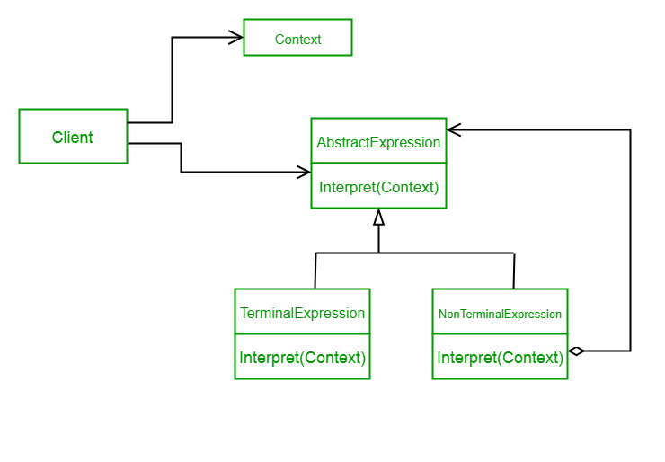

Interpreter pattern is used to defines a grammatical representation for a language and provides an interpreter to deal with this grammar. In this pattern the grammar is defined in an object-oriented way which can be evaluated by the interpreter.

This pattern involves implementing an expression interface which tells to interpret a particular context. Context contains information that is global to all expressions that define interpret() operation.

Checklist to apply interpreter pattern:
- Define a grammar for the language.
- Map each production in the grammar to a class.
- Organize the suite of classes into the structure of the Composite pattern.
- Define an `interpret(Context)` method in the Composite hierarchy.
- Use the Context object to encapsulate the current state of the input and output as the former is parsed and the latter is accumulated. It is manipulated by each grammar class as the "interpreting" process transforms the input into the output.

We are going to create an interface `Expression` and concrete classes implementing the Expression interface. A class `TerminalExpression` is defined which acts as a main interpreter of context in question. Other classes OrExpression, AndExpression are used to create combinatorial expressions aka `NonTerminalExpression`.

Demo class:

[../src/main/java/sample/designpattern/interpreter/Demo.java](../src/main/java/sample/designpattern/interpreter/Demo.java)