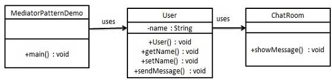

Mediator pattern defines an object that encapsulates how a set of objects interact. Mediator promotes loose coupling by keeping objects from referring to each other explicitly, and it lets you vary their interaction independently. This pattern helps to model a class whose object at run-time is responsible for controlling and coordinating the interactions of a group of other objects.

Mediator pattern is used to reduce communication complexity between multiple objects or classes. This pattern provides a mediator class which normally handles all the communications between different classes and supports easy maintenance of the code by loose coupling.

Use example of a chat room where multiple users can send message to chat room and it is the responsibility of chat room to show the messages to all users. We have created two classes ChatRoom and User. User objects will use ChatRoom method to share their messages.

Demo class:

[../src/main/java/sample/designpattern/mediator/Demo.java](../src/main/java/sample/designpattern/mediator/Demo.java)

