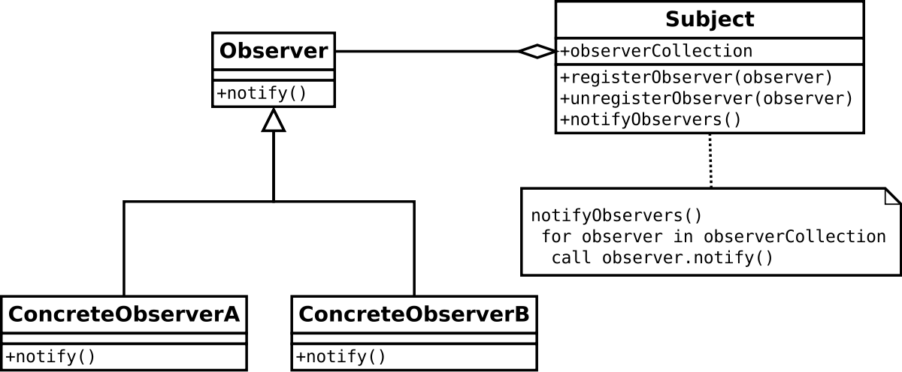

Observer pattern defines a one-to-many dependency between objects so that when one object changes state (the **Subject**), all its dependents (the **Observers**) are notified and updated automatically.

Applicability:
- when an abstraction has two aspects, one dependent on the other
- when a change to one object requires changing others, and you don't know how many objects need to be changed
- when an object should notify other objects without making assumptions about who these objects are

Observer pattern uses three actor classes. Subject, Observer and Client. Subject is an object having methods to attach and detach observers to a client object. We have created an abstract class Observer and a concrete class Subject. One to many dependency is between Subject(One) and Observer(Many).

Main class:

[../src/main/java/sample/designpattern/observer/Demo.java](../src/main/java/sample/designpattern/observer/Demo.java)

