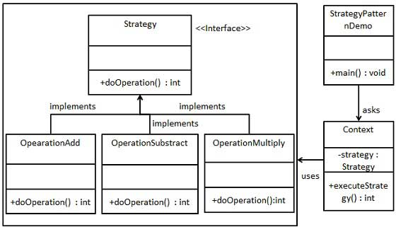

In Strategy pattern, a class behavior or its algorithm can be changed at run time. This type of design pattern comes under behavior pattern.

By Wikipedia, The strategy pattern
- defines a family of algorithms
- the algorithms interchangeable within that family at runtime
- new algorithms complying with the same interface can be easily introduced
- encapsulates each algorithm, the implementation of an algorithm can be changed without affecting the Context class

In Strategy pattern, we create objects which represent various strategies and a context object whose behavior varies as per its strategy object. The strategy object changes the executing algorithm of the context object.

Demo class:

[../src/main/java/sample/designpattern/strategy/Demo.java](../src/main/java/sample/designpattern/strategy/Demo.java)

